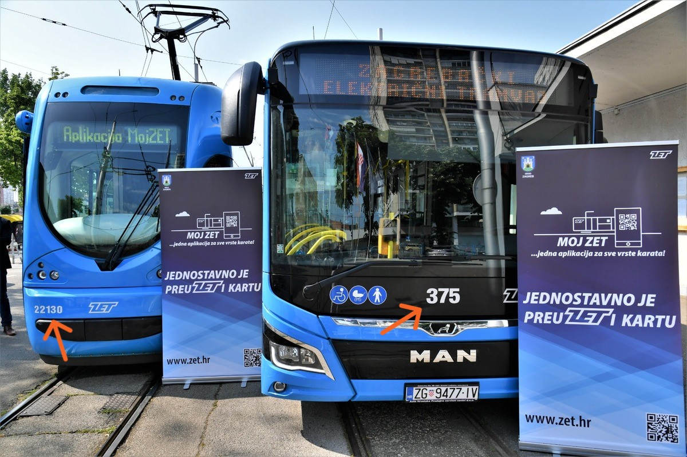
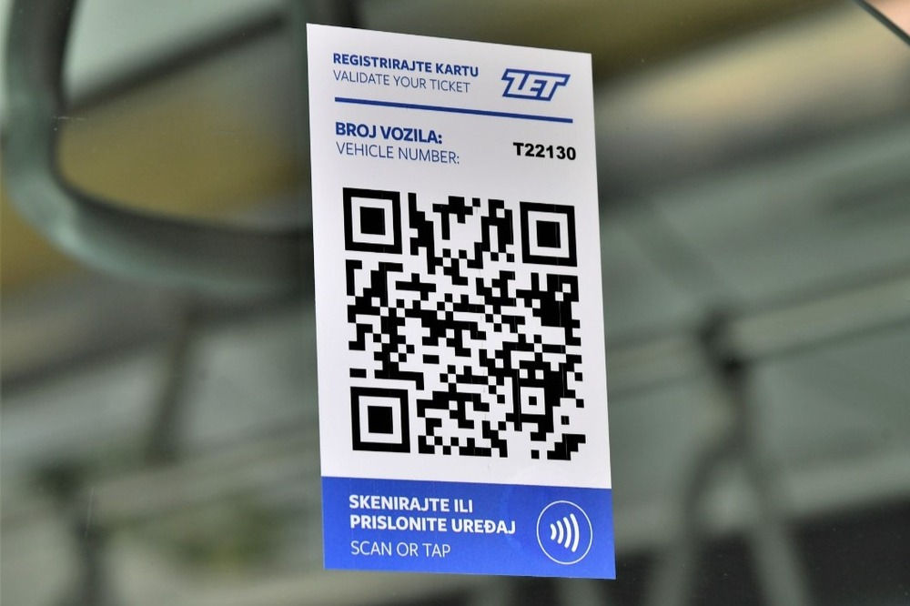
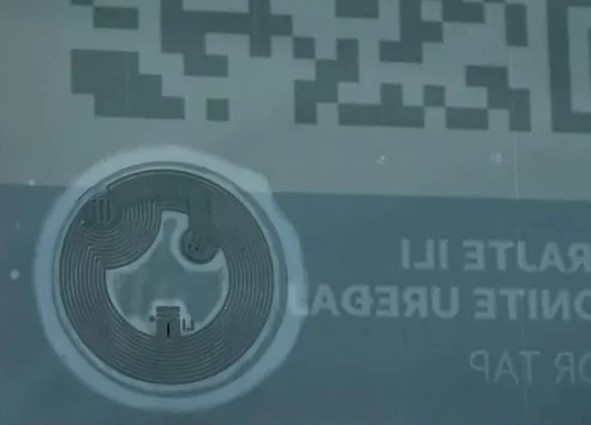

# Moj ZET mobilna aplikacija – Vodič za kupnju karata (QR i NFC)

> **VAŽNO**\
> Ovaj dokument je stvoren **strojnim prevođenjem** izvornog README dokumenta na engleskom jeziku. Za potpunu točnost i kontekst, molimo provjerite [izvorni README na engleskom](README.md).\
> Oba dokumenta će biti sadržajno usklađeni.

## Upozorenje (Disclaimer)

> Ja i ovaj projekt **nismo** povezani s društvom Zagrebački električni tramvaj d.o.o. (ZET). Sadržaj u nastavku služi **isključivo u edukativne i informativne svrhe**, te odražava ponašanje sustava prema zapažanjima u trenutku pisanja. **Ne jamčim** da je ova metoda službeno odobrena ili da će trajno funkcionirati. Korištenjem ovih uputa prihvaćate **punu odgovornost** za svoje postupke, uključujući poštivanje ZET-ovih Uvjeta korištenja te propisa o javnom prijevozu.
> Uvjete korištenja aplikacije možete pronaći [ovdje](https://moj.zet.hr/Account/About).

## Sadržaj

- [Moj ZET mobilna aplikacija – Vodič za kupnju karata (QR i NFC)](#moj-zet-mobilna-aplikacija--vodič-za-kupnju-karata-qr-i-nfc)
  - [Upozorenje (Disclaimer)](#upozorenje-disclaimer)
  - [Sadržaj](#sadržaj)
  - [Pregled](#pregled)
    - [Cilj](#cilj)
    - [Opseg](#opseg)
  - [Važne napomene](#važne-napomene)
  - [Kako funkcionira](#kako-funkcionira)
    - [QR kodovi](#qr-kodovi)
    - [NFC oznake (NTAG213)](#nfc-oznake-ntag213)
  - [Korak-po-korak: Izrada vlastitih QR kodova ili NFC oznaka](#korak-po-korak-izrada-vlastitih-qr-kodova-ili-nfc-oznaka)
    - [Izrada QR koda](#izrada-qr-koda)
    - [Pisanje na NTAG213 oznaku](#pisanje-na-ntag213-oznaku)
  - [Primjerne datoteke](#primjerne-datoteke)
  - [Odabir zone i uspinjače](#odabir-zone-i-uspinjače)
  - [Korištenje i provjera karata](#korištenje-i-provjera-karata)
  - [Dodatne tehničke pojedinosti](#dodatne-tehničke-pojedinosti)
  - [Pravilno korištenje](#pravilno-korištenje)
  - [Buduće promjene / ažuriranja](#buduće-promjene--ažuriranja)
  - [Dodatne preporuke](#dodatne-preporuke)
    - [ZetLoc](#zetloc)
    - [ZET info](#zet-info)
      - [GTFS Realtime – Ograničenja](#gtfs-realtime--ograničenja)
  - [Licenca](#licenca)
  - [Kontakt / Issues](#kontakt--issues)
  - [Upozorenje (ponovljeno)](#upozorenje-ponovljeno)

---

## Pregled

Uz mobilnu aplikaciju **Moj ZET** omogućena je kupnja karte skeniranjem naljepnica (koje sadržavaju QR kodove i NFC oznake) s označenim brojem vozila (npr. `T22130`).\
Međutim, putnicima može biti nezgodno fizički skenirati službene naljepnice postavljene unutar vozila ZET-a, osobito radi nezgodne lokacije naljepnica ili u slučaju velikih gužvi.

### Cilj

Omogućiti korisnicima da unaprijed izrade i nose **vlastiti** QR ili NFC kôd, kako bi ubrzali kupnju karata.

### Opseg

Ovaj vodič objašnjava kako izraditi osobni QR kôd ili praznu NFC oznaku koju aplikacija prepoznaje poput službene naljepnice. Možete je nositi u novčaniku, na privjesku za ključeve ili na vlastitoj NTAG213 naljepnici ili privjesku.

Za službene upute o instalaciji i korištenju aplikacije, pogledajte [službenu stranicu](https://www.zet.hr/cijene-prodaja-i-placanje/aplikacija-mojzet/8098).

---

## Važne napomene

1. **Bez službene povezanosti**: Ja sam neovisan entuzijast javnog prijevoza bez ikakvog odobrenja ZET-a.
2. **Edukativna svrha**: Informacije pokazuju kako izraditi osobni QR/NFC kôd isključivo radi praktičnosti.
3. **Koristite na vlastitu odgovornost**: Ne odgovaram ako ZET obustavi ili promijeni format, ili ako način korištenja prekrši određena pravila.
4. **Nema jamstva prihvaćanja**: ZET u svakom trenutku može promijeniti svoju politiku ili sustav bez najave. Današnje rješenje sutra možda neće raditi.
5. **Ne služi za izbjegavanje plaćanja**: Ovaj vodič **nije** namijenjen pomaganju u vožnji bez plaćanja ili kupnji karte tek pri pojavi kontrolora. Vi ste odgovorni kupiti valjanu kartu **prije** ili pri ulasku u vozilo, u skladu s pravilima o javnom prijevozu.

---

## Kako funkcionira

Aplikacija **Moj ZET** obično identificira vozilo na kojem se nalazite skeniranjem naljepnice s informacijama kao što su:

- **Tramvaji**: `T<BROJ_GARAŽE_VOZILA>` (npr. `T22130` za tramvaj garažnog broja 22130)
- **Autobusi**: `B<BROJ_GARAŽE_VOZILA>` (npr. `B375` za autobus garažnog broja 375)

*Vozila s navedenim garažnim brojevima:*\
\
*Izvor: Grad Zagreb putem [www.zagreb.hr](https://www.zagreb.hr/en/predstavljena-aplikacija-moj-zet-za-digitalnu-kupn/188168)*

### Više o naljepnicama

*Primjer naljepnice u tramvaju:*\
\
*Izvor: Grad Zagreb putem [www.zagreb.hr](https://www.zagreb.hr/en/predstavljena-aplikacija-moj-zet-za-digitalnu-kupn/188168)*

#### QR kodovi

- **Službeni** QR kôd unutar vozila obično je jednostavan niz, npr. `T22130` ili `B375`.
- Kada ga skenirate, aplikacija pretpostavlja da ste upravo u tom vozilu.

#### NFC oznake (NTAG213)

- Službene ZET NFC naljepnice sadrže tekst `T22130` (ili odgovarajući garažni broj), plus moguće dodatne metapodatke.
- Koriste **NDEF** format na **NTAG213** čipu.
- NFC čip, iako pomalo skriven na prednjoj strani naljepnice, može se jasno vidjeti ako se promatra sa stražnje strane:\
\
*Izvor: Portofon.com putem [www.portofon.com](https://www.portofon.com/savjeti/kako-se-koristi-aplikacija-moj-zet)*

---

## Korak-po-korak: Izrada vlastitih QR kodova ili NFC oznaka

### Izrada QR koda

1. **Odaberite metodu izrade QR koda**
   - Primjer: [Project Nayuki QR Code generator library](https://www.nayuki.io/page/qr-code-generator-library) ili neko drugo rješenje.

2. **Unesite tekst**  
   - Npr. `T22130` (tramvaj #22130) ili `B375` (autobus #375).
   - Prilagodite prema vozilu koje najčešće koristite. Nije posebno bitno dokle god to vozilo i zapravo postoji.
   - **Napomena:** Još nije potvrđeno vrijedi li bilo koji broj ili mora biti unesen u aplikacijsku bazu podataka.

3. **Ispišite**  
   - Ispišite (print) naljepnicu ili karticu sa svojim QR kôdom i postavite je na često korišteni predmet.
   - **Ne možete** uvesti lokalno spremljen QR kôd izravno u aplikaciju Moj ZET, stoga je najpraktičnije imati fizički kôd pri ruci (npr. u novčaniku).

### Pisanje na NTAG213 oznaku

1. **Nabavite praznu NTAG213 NFC oznaku**
   - Mogu se pronaći online (npr. na [AliExpressu](https://www.aliexpress.com/wholesale?SearchText=ntag213)) po pristupačnim cijenama.
   - Provjerite podržava li vaš mobitel pisanje NFC-a. iPhonei mogu pisati na NTAG213, no moguće su restrikcije ovisno o verziji iOS-a ili starijim uređajima (prije iPhone 7).
   - Osim naljepnica, postoje i NTAG213 privjesci za ključeve.

2. **Instalirajte aplikaciju za pisanje NFC-a**
   - Primjer: [NFC Tools](https://www.wakdev.com/en/apps/nfc-tools-android.html) (dostupna na Androidu i iOS-u).
     - [Android](https://play.google.com/store/apps/details?id=com.wakdev.wdnfc)
     - [iPhone](https://apps.apple.com/hr/app/nfc-tools/id1252962749)
   - Alternativa: [NXP TagWriter](https://play.google.com/store/apps/details?id=com.nxp.nfc.tagwriter) (popularno za Android).

3. **Kreirajte tekstualni zapis (NDEF)**
   - Zapišite sadržaj vašeg garažnog broja, npr. `T22130` ili `B375`.

---

## Primjerne datoteke

U mapi [`examples/`](./examples) nalaze se:

1. **`qr-example-T9999.png`** – *primjer* QR koda koji sadrži tekst `T9999`.\
   
   - Služi samo za demonstraciju.
   - **Nije** pravi ZET garažni broj (bar se nadam).

2. **`ntag213-dump-sample.bin`** – *primjer* NFC NDEF zapisa s tekstom `T9999`, uz dodatne metapodatke. (Ovo će biti dodano ubrzo.)
   - Također samo za demonstraciju.
   - Možda neće raditi u Moj ZET aplikaciji, ovisno o budućim izmjenama.

> **Upozorenje**: Ove datoteke prikazuju samo kako podaci mogu izgledati. **Nisu** službene ZET oznake/kodovi i aplikacija Moj ZET ih možda neće prepoznati. Koristite ih na vlastitu odgovornost, poštujući ZET-ove Uvjete korištenja.

---

## Odabir zone i uspinjače

U aplikaciji **Moj ZET**, prije skeniranja ili očitavanja koda/oznake, možete odabrati:

- **Zonu 1**, **Zonu 2** ili zagrebačku uspinjaču, uz različito trajanje karata.
  - Dostupna je i **Karta II zone - 180 minuta** koja vrijedi za obje zone.
- **Uspinjača** se kupuje na isti način (odaberete "*Uspinjača*" umjesto zone).
  - Karte za uspinjaču (ponekad navedene kao **Zona 4** u aplikaciji) vrijede samo **u jednom smjeru** (gore ili dolje).
- GPS je opcionalan – ako je isključen, aplikacija će vas ručno zatražiti da odaberete zonu.

---

## Korištenje i provjera karata

- **Kontrolori** uglavnom provjeravaju imate li **valjanu (aktivnu) kartu**. Ne uspoređuju garažni broj u aplikaciji s vozilom, jer bi to bilo nepraktično.
  - Karta vrijedi dok pokriva zonu i ima dovoljno vremena u trenutku provjere.
- **Trenutačna zapažanja** pokazuju da sustav **ne** strogo provjerava slaže li se očitani kôd s pravim brojem vozila, dijelom zbog mogućih problema s ATRON računalima ili izmijenjenih ruta.
  - Više detalja o ATRON sustavu: [mreza.bug.hr](https://mreza.bug.hr/promo/atron-ov-kontrolni-centar-24236).
- **GPS/Lokacija**: Ako je uključena, aplikacija može predložiti zonu temeljem lokacije uređaja, ali uvijek možete sve postaviti ručno.

---

## Dodatne tehničke pojedinosti

- **NTAG213** je NFC oznaka tipa 2 s otprilike **144 bajta** memorije za NDEF podatke.
  - Moguće je pohraniti otprilike 132 znaka u URI (URL) formatu ili 130 znakova običnog teksta.
  - Procijenjeni vijek trajanja je oko 10 godina, uz oko 100k ciklusa čitanja/pisanja.
- **NDEF (NFC Data Exchange Format)** je standardni format za pohranu zapisa (tekst, URL itd.).
- Službene ZET oznake obično sadrže kratki tekst (npr. `T22130`), no moguće je da uključuju dodatne blokove metapodataka.
- **iPhone vs. Android**:
  - Moderni iPhone uređaji (iOS 13+) obično mogu pisati na NTAG213 putem specifičnih aplikacija.
  - Android uređaji uglavnom imaju manje ograničenja i mogu čitati/pisati na većinu NFC oznaka usklađenih s NFC Forumom.

---

## Pravilno korištenje

- **Kupite kartu prije ili odmah po ulasku**: Odgovorni ste za posjedovanje valjane karte. Nemojte čekati kontrolore.
- **Poštujte pravila prijevoza**: Ova metoda samo olakšava izbjegavanje fizičkog skeniranja službene naljepnice u gužvi ili kada je naljepnica teže dostupna, **ne** služi za izbjegavanje plaćanja.

---

## Buduće promjene / ažuriranja

Moguće je da ZET:

- Počne strože provjeravati broj vozila i uspoređivati ga s lokacijom putnika.
- Blokira uporabu vanjskih (neslužbenih) kodova.

Kao svakodnevni korisnik, pratim ponašanje aplikacije i ažurirat ću ovaj vodič prema potrebi. Ako primijetite da aplikacija počinje tražiti usklađenost garažnog broja s vozilom, molim otvorite [GitHub issue](https://github.com/fscek/moj-zet-app-guide/issues).

---

## Dodatne preporuke

### ZetLoc

Ova neovisna web-stranica (anonimnog autora) omogućuje pregled GPS lokacija ZET vozila uživo, koristeći [GTFS Realtime podatke](https://www.zet.hr/odredbe/datoteke-u-gtfs-formatu/669) koje ZET pruža.
Također podržava unos više linija razdvojenih zarezom, npr. `2,6,11`, za istovremeni prikaz više linija.

[**ZetLoc** Web](https://zetloc.quest)

### ZET info

*ZET info* je poznata aplikacija za Android i iOS, također povezana s GTFS Realtime podatcima ZET-a. Omogućuje pregled stanica, dolazaka i više informacija. Korisna je za one koji se voze javnim prijevozom u Zagrebu.

[**ZET info** Web](https://zet-info.com)

#### GTFS Realtime – Ograničenja

Zbog ranije spomenutih poteškoća s ATRON sustavom, **mnoga** vozila (posebno autobusi) nemaju aktivno GPS praćenje, što ponekad smanjuje korisnost ovih aplikacija.

---

## Licenca

Ovaj vodič i popratni materijali (koji **nisu** vlasništvo ZET-a) licencirani su pod [MIT licencom](LICENSE). Ta licenca **ne** pokriva ZET-ove logotipe, službene aplikacije ili podatke.

---

## Kontakt / Issues

- **Upiti o projektu**: Otvorite GitHub issue ili pull request ako pronađete pogrešku ili imate prijedloge.
- **Službeni ZET upiti**: Za pitanja o pravilima ZET-a posjetite [ZET web-stranicu](https://www.zet.hr/).
- **Pravna obavijest**: Ako ZET zatraži uklanjanje ili izmjenu sadržaja koji krši njihove uvjete, uskladit ću se s time bez odgode.

---

## Upozorenje (ponovljeno)

> Ova su zapažanja i upute podijeljene u dobroj vjeri kako bi se korisnicima olakšala kupnja karata. **Ne preuzimam odgovornost** za eventualna kršenja pravila javnog prijevoza. Korištenjem ovog vodiča prihvaćate da ste **isključivo vi** odgovorni za poštivanje ZET-ovih Uvjeta korištenja.
