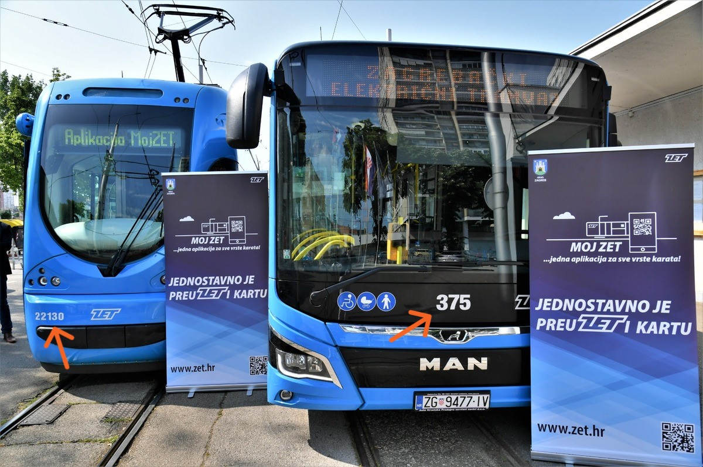
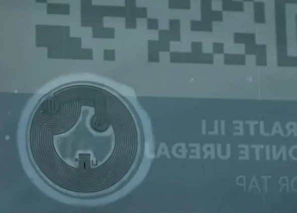
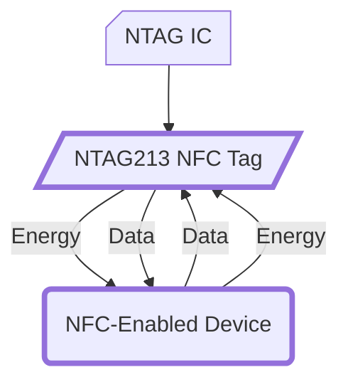

# **Moj ZET** Mobile App – Ticket Purchase Guide (QR & NFC)
{: .no_toc }

> **Looking for the Croatian version?**
> [Kliknite ovdje za hrvatski jezik](index_hr.md)

## Disclaimer

> Myself and this project are **not** affiliated with Zagrebački električni tramvaj d.o.o. (ZET). The content below is shared solely for **educational and informational purposes** and reflects the system's behaviour as observed at the time of writing. I do **not** guarantee that this method is officially approved or that it will work indefinitely. By using these instructions, you agree to assume all responsibility for your actions, including compliance with ZET's Terms & Conditions and local transport regulations.
> The app's T&Cs can be found [here](https://moj.zet.hr/Account/About){:target="_blank" rel="noopener"}.

  
Table of Contents

  {: .text-delta }

1. TOC
{:toc}

## Overview

With the **Moj ZET** mobile app, you can quickly purchase a ticket by scanning an official sticker (containing QR codes or NFC tags) representing the vehicle number (e.g., `T22130`).\
However, passengers may find it inconvenient to physically scan the stickers placed inside ZET vehicles due to their awkward locations — especially when it's crowded.

### Goal

Enable people to generate and carry **their own** scannable QR or NFC tag in advance to speed up ticket purchasing.

### Scope

This guide explains how to create a personal QR code or blank NFC tag that the app recognises the same way it would an official sticker. You can then keep it in your wallet, on your keychain, or on a personally written NTAG213 sticker or an NTAG213 keychain.

### Target Audience

This guide is intended for regular users of Zagreb's public transport system who wish to streamline their ticket purchasing process using the **Moj ZET** mobile app. It is particularly useful for frequent commuters who prefer using QR codes or NFC tags over traditional ticket methods. **Tech enthusiasts and geeks are also welcome to delve deeper into the technical aspects of QR and NFC functionalities within the app.**

For official app installation and usage instructions, see [this guide](https://www.zet.hr/cijene-prodaja-i-placanje/aplikacija-mojzet/8098){:target="_blank" rel="noopener"}.

---

## Important Disclaimers

1. **No Official Affiliation:** I am an independent public transport enthusiast with **no** endorsement from ZET.
2. **Educational Purposes Only:** This information demonstrates how one might create a personal QR/NFC code purely for convenience.
3. **Use at Your Own Risk:** I cannot be held liable if ZET discontinues or changes the format, or if your usage violates any rules.
4. **No Guarantee of Acceptance:** ZET may change its policy or system without notice. What works today may not work tomorrow.
5. **Not a Fare Evasion Tool:** This guide is **not** intended to help anyone ride for free or only buy tickets when inspectors appear. You are responsible for purchasing valid tickets **before** or upon boarding, in accordance with existing transport rules.

---

## How It Works

The **Moj ZET** app typically identifies the vehicle you're on by scanning a sticker containing information like:

- **Trams:** `T<VEHICLE_GARAGE_NUMBER>` (e.g., `T22130` for a tram numbered 22130)
- **Buses:** `B<VEHICLE_GARAGE_NUMBER>` (e.g., `B375` for a bus numbered 375)

*Vehicles bearing the aforementioned garage numbers:*\
\
*Source: City of Zagreb via [www.zagreb.hr](https://www.zagreb.hr/en/predstavljena-aplikacija-moj-zet-za-digitalnu-kupn/188168){:target="_blank" rel="noopener"}*

### About The ZET Stickers

*Example sticker in a tram:*\
\
*Source: City of Zagreb via [www.zagreb.hr](https://www.zagreb.hr/en/predstavljena-aplikacija-moj-zet-za-digitalnu-kupn/188168){:target="_blank" rel="noopener"}*

#### QR Codes

- The **official** onboard QR code is a simple text string like `T22130` or `B375`.
- When scanned, the app recognises it as being on that vehicle.

#### NFC Tags (NTAG213)

- Official ZET NFC stickers contain the same `T22130` text (or whichever the garage number is), along with some secondary records and metadata used by the app.
- They use the **NDEF** format on an **NTAG213** chip.
- The NFC tag, while slightly hidden on the front of the sticker, can be clearly seen when viewing the sticker from the back:\
\
*Source: Portofon.com via [www.portofon.com](https://www.portofon.com/savjeti/kako-se-koristi-aplikacija-moj-zet){:target="_blank" rel="noopener"}*

---

## Step-by-Step: Generating Your Own QR Codes or NFC Tags

### Creating a QR Code

1. **Choose a QR Generation Method**
   - For instance, use [Project Nayuki's QR Code generator library](https://www.nayuki.io/page/qr-code-generator-library){:target="_blank" rel="noopener"} or another online generator to generate the QR code and save it.
2. **Enter the Text**
   - For example, `T22130` (tram #22130) or `B375` (bus #375).
     - Adjust for your preferred or most-frequent vehicle. It doesn't really matter, as long as the vehicle exists.
   - **Note:** I have yet to confirm whether *any* number works or if it must exist in the app's vehicle database.
3. **Print**
   - Print the saved QR code image on a small sticker or label (on sticker paper, or as a small laminated card) containing the QR code and attach it to a commonly used personal item.
   - You **cannot** import a locally saved QR code *directly* into the **Moj ZET** app, so having a physical code on a wallet/keychain is most convenient.
     - Scanning the code from another screen is still an option, but it may be too impractical.

### Writing to an NTAG213 Tag

1. **Obtain a Blank NTAG213 NFC Tag**
   - These are widely available (e.g., [AliExpress](https://www.aliexpress.com/wholesale?SearchText=ntag213){:target="_blank" rel="noopener"}) at low cost.
   - Ensure your phone supports NFC writing. iPhones can write to NTAG213 but may have some limitations depending on iOS version or if an older (I believe, pre-iPhone 7+) device is used.
   - Besides NFC stickers, NTAG213 NFC keychains can be used as well.
     > **❗ Important:**  
     If you wish to stick the NFC sticker tag to a metal object or surface, make sure to search for *On-metal*/*Anti-metal* tags, as these have a ferrite barrier or coating to enable scanning when placed on top of metal surfaces.
2. **Install an NFC Writing App**
   - For example, [NFC Tools](https://www.wakdev.com/en/apps/nfc-tools-android.html){:target="_blank" rel="noopener"} (available on both Android & iOS).
     - [Android](https://play.google.com/store/apps/details?id=com.wakdev.wdnfc)
     - [iPhone](https://apps.apple.com/hr/app/nfc-tools/id1252962749)
   - Alternatively, [NXP TagWriter](https://play.google.com/store/apps/details?id=com.nxp.nfc.tagwriter) is a popular choice on Android.
3. **Create a Text Record**
   - Write a simple `Text Record` (NDEF) with your chosen vehicle number, e.g., `T22130` or `B375`.
   - **Recommendation:**  
     Focus solely on creating the **`Text Record`** for simplicity and to avoid unnecessary complexity (e.g., excluding the Firebase `URI` and `AAR` - more details found in the [*Detailed NFC Records Analysis* section below](#additional-technical-details--findings)).
4. **Write The Record To a Tag**
   - Use the NFC writing app to write the created `Text Record` to your NTAG213 tag.
5. **Security Best Practices**
   - **Verify Tag Integrity:**  
     After writing, verify the tag's contents to ensure accuracy.
   - **Use Password-Protected or Locked Tags:**  
     - To prevent tampering, use NTAG213 tags that support password protection.
     - If you do not intend on editing the tag afterwards, feel free to lock it.
     > **⚠️ Warning:** Locking an NFC tag is a permanent action. Ensure that all information is correct before proceeding.

---

## Example Files

In the [`examples/`](examples) folder, you'll find:

- **`qr-example-T9999.png`** – a *sample* QR code encoding the text `T9999`.\

  - This is purely for demonstration.
  - **Not** an actual ZET vehicle number (hopefully).

> **Note:** A NTAG213 sample dump file has been omitted for security and privacy reasons. Please refer to the [*Detailed NFC Records Analysis* section below](#additional-technical-details--findings) for more information.  
> **Disclaimer:** This example file is shared solely to illustrate how the data might look or be structured. It **does not** represent an official ZET code and may not be recognised by **Moj ZET**. Use at your own risk, and always follow ZET's Terms & Conditions.

---

## Zone and Funicular Selection

In the **Moj ZET** app, before scanning or detecting a code/tag, you can select:

- **Zone 1**, **Zone 2**, or the **Zagreb Funicular**, along with ticket durations for each zone.
  - A combined **Karta II zone - 180 minuta** option is also available, allowing travel in both zones.
- **Funicular** tickets can also be purchased via the same process (choose "*Uspinjača*" instead of a zone).
  - The funicular tickets (sometimes labelled as **Zone 4** in the app) are strictly **one-way** (up or down single tickets).
- GPS is optional — if disabled, the app will ask you to manually select your zone.

---

## Usage & Validation Notes

- **ZET Ticket Inspectors** generally just check for an **active ticket**. They do **not** compare your vehicle number to the actual vehicle, as this would be cumbersome.
  - A ticket is valid as long as it's for the correct zone and with enough remaining time at the moment of inspection.
- **Current Observations** suggest that the system does **not** strictly verify the scanned code against the actual vehicle number, due to potential syncing/technical issues with onboard ATRON computers or route changes.
  - More details on the ATRON system can be found [here](https://mreza.bug.hr/promo/atron-ov-kontrolni-centar-24236){:target="_blank" rel="noopener"}.
- **GPS/Location:** If enabled, the app may use your phone's location to suggest a zone, but you can always set it manually.

---

## Encouraging Proper Use

- **Buy Before or Upon Boarding:**  
  You are responsible for having a valid ticket. Do not wait until ticket inspectors appear.

- **Respect Transit Rules:**  
  This method is meant to avoid physically scanning the official sticker in a crowd or when a sticker is missing/obscured, **not** to cheat the system.

---

## Additional Resources

### ZetLoc

This nice little third-party website from an anonymous author enables you to see real-time GPS ZET vehicle positions using the [GTFS Realtime feed data](https://www.zet.hr/odredbe/datoteke-u-gtfs-formatu/669){:target="_blank" rel="noopener"} ZET provides.\
It also accepts comma-separated value inputs, such as `2,6,11`, in order to see vehicles on multiple lines at once.

[`ZetLoc` Web](https://zetloc.quest){:target="_blank" rel="noopener"}

### ZET info

*ZET info* is a well-known Android & iOS app, also using the ZET GTFS Realtime feed data. It enables you to see stations, upcoming arrivals and more. A must-have when using Zagreb public transport.

[`ZET info` Web](https://zet-info.com){:target="_blank" rel="noopener"}

#### GTFS Realtime Feed Disclaimer

Due to the aforementioned issues with the ZET ATRON system, **a lot** of the buses do not have their GPS tracking activated, so these apps are sometimes less useful when using buses.

---

## Additional Technical Details & Findings

This section delves deeper into the technical aspects and recent findings related to the **Moj ZET** NFC tags and the associated app functionality.

### NFC Tag Structure and Records

Understanding the structure of NFC tags used by the **Moj ZET** app is crucial for creating compatible tags.

- **NTAG213:**  
  A Type 2 NFC tag with about **144 bytes** of usable memory for NDEF data. This allows storing:
  - 132 characters in URI (or URL) format
  - 130 characters in plain text format

- **Data Retention:**  
  Estimated at 10 years, with endurance rated at 100k read/write cycles.

- **NDEF (NFC Data Exchange Format):**  
  A standard data format for storing records (text, URIs, etc.).

- **Official ZET Tags:**  
  Typically store a text record (e.g., `T22130`), with the inclusion of extra metadata records used by the application.

### Cross-Platform Compatibility

- **Android Devices:**  
  - Mostly support all record types (`Text Record`, `URI`, and `AAR`).
  - They usually have fewer limitations and can read/write to most NFC Forum–compliant tags.

- **iOS Devices:**
  - Modern iPhones (iOS 13+) can often write to NTAG213 tags through specific apps.
  - They primarily use the `Text Record` and `URI`, as `AAR` is an Android-specific feature.

- **Dedicated RFID (NFC) Devices:**
  - They usually have no restrictions in reading, writing or modifying the NTAG213 tags in any way.

---

  
📄 Detailed NFC Records Analysis

  
#### Record 1: Text Record

- **Type:** Text (`T` or `0x54`)
- **Format:** NFC Well Known (`0x01`)
- **Defined by:** RFC 2141, RFC 3986
- **Value:**
  - **Encoding:** UTF-8
  - **Language:** Croatian (`hr`)
  - **Text:** `T22130`
- **Raw Value:** `hrT22130`
- **Payload:** `[SANITISED]`
  
**Explanation:**  
This text record contains the vehicle identifier (`T22130`), which the **Moj ZET** app uses to recognize the specific tram. The prefix `T` denotes a **tram**, followed by its unique vehicle garage number.
  
#### Record 2: URI Record

- **Type:** URI (`U` or `0x55`)
- **Protocol:** `https://` (`0x04`)
- **Format:** NFC Well Known (`0x01`)
- **Defined by:** RFC 2141, RFC 3986
- **Value:** `https://mojzet.page.link/[SANITISED]`
- **Raw Value:** `mojzet.page.link/[SANITISED]`
- **Payload:** `[SANITISED]`
  
**Explanation:**  
This URI record likely points to a Firebase Dynamic Link associated with the **Moj ZET** app. The `https://mojzet.page.link/[SANITISED]` URL may be used for actions like authentication, data synchronization, or providing additional information related to the tram.

> **Known Issues:** Accessing the Firebase link directly in a browser without the appropriate routing produces an error:  
> *"Invalid Dynamic Link: Requested URL must be a parsable and complete DynamicLink."*  
> This suggests that the Firebase Dynamic Links are misconfigured or overly reliant on specific conditions.  
>
> **Implication:** This link does not impact ticket validation functionality within the **Moj ZET** app. It is supplemental metadata that can safely be ignored if non-functional.
  
#### Record 3: Android Application Record (AAR)

- **Type:** Android App (`android.com:pkg`)
- **Format:** NFC External (`0x04`)
- **Defined by:** RFC 2141, RFC 3986
- **Raw Value:** `com.zetmobile`
- **Payload:** `[SANITISED]`
  
**Explanation:**  
This record specifies the package name of the official **Moj ZET** Android application (`com.zetmobile`). It ensures that the NFC tag interacts correctly with the intended app (**Moj ZET** in this case), preventing unauthorized applications from misinterpreting the tag data.

  
📄 Firebase Dynamic Links

- **Included in NFC Tags:**  
  The NFC tags contain a **URI record** pointing to a Firebase Dynamic Link (e.g., `https://mojzet.page.link/[SANITISED]`).

- **Functionality:**  
  These links are intended for actions like authentication, data synchronization, or providing additional information related to the tram.

> **Known Issues:**  
> Accessing the Firebase link directly without the appropriate routing produces an error:  
> *"Invalid Dynamic Link: Requested URL must be a parsable and complete DynamicLink."*  
> This suggests that the Firebase Dynamic Links are misconfigured or overly reliant on specific conditions.  
>
> **Implication:** This link does not impact ticket validation functionality within the **Moj ZET** app. It is supplemental metadata that can safely be ignored if non-functional.

  
📄 Android Application Record (AAR)

- **Purpose:**  
  The AAR specifies the package name of the official **Moj ZET** Android application (`com.zetmobile`).  
  This ensures that the NFC tag interacts correctly with the intended app, preventing unauthorized applications from misinterpreting the tag data.

- **Observation:**  
  The AAR is not required for the app to function properly in validating tickets. It is merely a convenience layer.

---

## Security Concerns

While creating custom NFC tags can enhance convenience, it's important to be aware of potential security risks associated with writable NFC tags.

### Writable NFC Tags

- **Nature:**  
  The official **Moj ZET** NFC tags **are writable**, meaning anyone with an NFC writer (including a smartphone) **can modify or overwrite the data**.

#### Potential Risks

1. **Tampering:**  
   Since the tags are installed in vehicles and remain static without regular inspection, malicious actors could rewrite the tags with invalid data, rendering them useless or misleading.  
   *Example: An attacker replaces `T22130` with `T00000`, causing confusion or disrupting the app's vehicle identification process.*

2. **Exploitation:**  
   An attacker could insert harmful or spoofed data, such as fake vehicle IDs or URLs leading to phishing sites. This could undermine user trust and pose security threats.  
   *Example: Injecting a malicious URL that redirects users to a phishing website when scanned.*

### Recommendations

#### For Users

1. **Personal Tags:**  
  When replicating NFC tags, use password-protected NTAG213 tags to prevent unauthorized modifications.

2. **Monitor Tag Integrity:**  
  Regularly check your custom NFC tags to ensure they haven't been tampered with.

#### For ZET

1. **Implement Write Protection:**  
   Use NFC tags that support password protection or are write-protected to prevent unauthorized modifications.

2. **Regular Tag Audits:**  
   Conduct periodic audits of NFC tags installed in vehicles to ensure they haven't been tampered with.

3. **Enhanced Authentication Mechanisms:**  
   Introduce authentication steps in the NFC writing process to ensure that only authorized personnel can modify tag data.

4. **Educate Staff and Users:**  
   Provide training for staff on the importance of NFC tag security and educate users about the potential risks of tampering.

---

## Future Changes / Updates

ZET may:

- Enforce stricter checks on vehicle data vs. user location.
- Change the app to reject external codes.

As a daily user of the app, I'll monitor its behaviour and update this guide accordingly. If you notice that the app starts enforcing vehicle-number matching, please open [an issue](https://github.com/fscek/moj-zet-app-guide/issues){:target="_blank" rel="noopener"}.

---

## License

This guide and any accompanying assets (that are **not** ZET's intellectual property) are licensed under the [MIT License](https://github.com/fscek/moj-zet-app-guide/blob/main/LICENSE){:target="_blank" rel="noopener"}. This license does **not** apply to ZET's logos, official apps, or data.

---

## Contact / Issues

- **Project Inquiries:** Open a GitHub issue or pull request if you find errors or have improvements.
- **Official ZET Inquiries:** For questions about ZET policies, see the [ZET website](https://www.zet.hr){:target="_blank" rel="noopener"}.
- **Legal Notice:** If ZET requests removal or changes to content violating their terms, I will comply promptly.

---

## Disclaimer (Reiterated)

> I share these observations in good faith to help riders purchase tickets more easily. **I am not responsible** for misuse or violations of transport rules dictated by ZET. By using this guide, you acknowledge that **you alone** are responsible for complying with ZET's Terms & Conditions.
