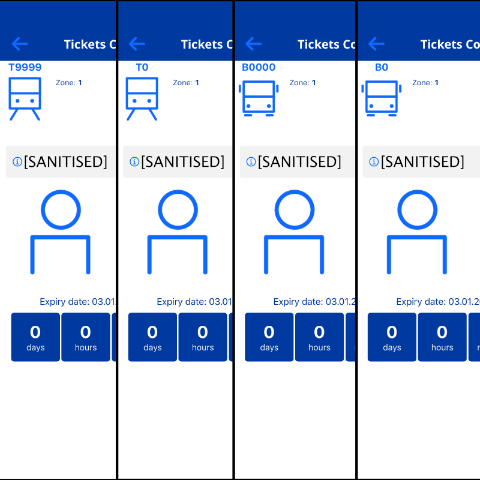
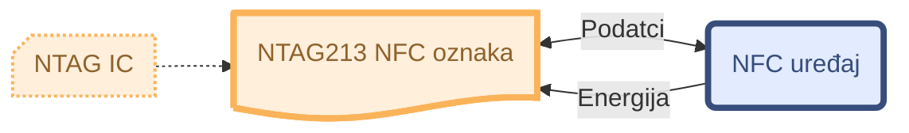

---

layout: default
title: Vodič na hrvatskom

---

# **Moj ZET** mobilna aplikacija – Vodič za kupnju karata (QR i NFC)
{: .no_toc }

> **VAŽNO**\
> Ovaj dokument je stvoren **strojnim prevođenjem** izvornog README dokumenta na engleskom jeziku. Za potpunu točnost i kontekst, molim provjerite [izvorni README na engleskom](index.md).\
> Oba dokumenta će biti sadržajno usklađeni.

---

## Upozorenje (Disclaimer)

> Ja i ovaj projekt **nismo** povezani s društvom Zagrebački električni tramvaj d.o.o. (ZET). Sadržaj u nastavku služi **isključivo u edukativne i informativne svrhe** i odražava ponašanje sustava prema zapažanjima u trenutku pisanja. **Ne jamčim** da je ova metoda službeno odobrena ili da će trajno funkcionirati. Korištenjem ovih uputa prihvaćate **punu odgovornost** za svoje postupke, uključujući poštivanje ZET-ovih Uvjeta korištenja te propisa o javnom prijevozu.
> Uvjete korištenja aplikacije možete pronaći [ovdje](https://moj.zet.hr/Account/About){:target="_blank" rel="noopener"}.

  
Sadržaj

  {: .text-delta }

1. TOC
{:toc}

## Pregled

Uz mobilnu aplikaciju **Moj ZET** omogućena je kupnja karte skeniranjem službene naljepnice (koja sadrži QR kodove i NFC oznake) s označenim brojem vozila (npr. `T22130`).\
Međutim, putnicima može biti nezgodno fizički skenirati naljepnice postavljene unutar vozila ZET-a zbog njihovih nezgodnih lokacija - osobito kada je gužva.

### Cilj

Omogućiti ljudima da unaprijed izrade i nose **vlastiti** QR kôd ili NFC oznaku kako bi ubrzali kupnju karata.

### Opseg

Ovaj vodič objašnjava kako izraditi osobni QR kôd ili praznu NFC oznaku koju aplikacija prepoznaje na isti način kao i službenu naljepnicu. Možete je nositi u novčaniku, na privjesku za ključeve ili na vlastitoj NTAG213 naljepnici ili privjesku.

### Ciljana publika

Ovaj vodič namijenjen je redovitim korisnicima ZET-a koji žele pojednostaviti proces kupnje karata koristeći mobilnu aplikaciju **Moj ZET**. Posebno je koristan za učestale putnike koji preferiraju korištenje QR kodova ili NFC oznaka umjesto tradicionalnih metoda kupnje karata. **Tehnički entuzijasti i *geekovi* također su dobrodošli da se dublje upuste u tehničke aspekte QR i NFC funkcionalnosti unutar aplikacije.**

Za službene upute o instalaciji i korištenju aplikacije, pogledajte [vodič na službenoj ZET stranici](https://www.zet.hr/cijene-prodaja-i-placanje/aplikacija-mojzet/8098){:target="_blank" rel="noopener"}.

---

## Važne napomene

1. **Bez službene povezanosti:** Ja sam neovisan entuzijast javnog prijevoza bez ikakvog odobrenja ZET-a.
2. **Edukativna svrha:** Ove informacije pokazuju kako izraditi osobni QR/NFC kôd isključivo radi praktičnosti.
3. **Koristite na vlastitu odgovornost:** Ne odgovaram ako ZET obustavi ili promijeni format, ili ako vaš način korištenja prekrši bilo koja pravila.
4. **Nema jamstva prihvaćanja:** ZET može promijeniti svoju politiku ili sustav bez najave. Ono što danas radi, sutra možda neće.
5. **Ne služi za izbjegavanje plaćanja:** Ovaj vodič **nije** namijenjen pomaganju bilo kome da se vozi besplatno ili kupnji karte tek pri pojavi kontrolora. Odgovorni ste za kupnju valjanih karata **prije** ili pri ulasku u vozilo, u skladu s postojećim propisima prijevoza.

---

## Kako funkcionira

Aplikacija **Moj ZET** obično identificira vozilo na kojem se nalazite skeniranjem naljepnice s informacijama kao što su:

- **Tramvaji:** `T<BROJ_GARAŽE_VOZILA>` (npr. `T22130` za tramvaj garažnog broja 22130)
- **Autobusi:** `B<BROJ_GARAŽE_VOZILA>` (npr. `B375` za autobus garažnog broja 375)

*Vozila s navedenim garažnim brojevima:*\
\
*Izvor: Grad Zagreb putem [www.zagreb.hr](https://www.zagreb.hr/en/predstavljena-aplikacija-moj-zet-za-digitalnu-kupn/188168){:target="_blank" rel="noopener"}*

### Više o naljepnicama

*Primjer naljepnice u tramvaju:*\
\
*Izvor: Grad Zagreb putem [www.zagreb.hr](https://www.zagreb.hr/en/predstavljena-aplikacija-moj-zet-za-digitalnu-kupn/188168){:target="_blank" rel="noopener"}*

#### QR kodovi

- **Službeni** QR kôd unutar vozila obično je jednostavan tekstni niz (*string*), poput `T22130` ili `B375`.
- Kada se skenira, aplikacija pretpostavlja da ste upravo u tom vozilu.

#### NFC oznake (NTAG213)

- Službene ZET NFC naljepnice sadrže isti tekst `T22130` (ili odgovarajući garažni broj), zajedno s nekim sekundarnim zapisima i metapodatcima koje koristi aplikacija.
- Koriste **NDEF** format na **NTAG213** čipu.
- NFC čip, iako malo skriven na prednjoj strani naljepnice, jasno se vidi kada se naljepnica promatra s poleđine:\
\
*Izvor: Portofon.com putem [www.portofon.com](https://www.portofon.com/savjeti/kako-se-koristi-aplikacija-moj-zet){:target="_blank" rel="noopener"}*

---

## Korak-po-korak: Izrada vlastitih QR kodova ili NFC oznaka

### Izrada QR koda

1. **Odaberite metodu izrade QR koda**
   - Na primjer, koristite [Project Nayuki QR Code generator library](https://www.nayuki.io/page/qr-code-generator-library){:target="_blank" rel="noopener"} ili neki drugi online generator za generiranje QR koda i njegovo spremanje.
2. **Unesite tekst**  
   - Na primjer, `T22130` (tramvaj #22130) ili `B375` (autobus #375).
     > **📝 Napomena:**  
     Čini se da aplikacija ne provjerava postoji li uistinu upisani broj vozila.
3. **Ispišite**  
   - Ispišite spremljeni QR kod na malu naljepnicu ili etiketu (na papir za naljepnice ili kao malu laminiranu karticu) s QR kodom i zalijepite ga na često korišteni predmet.
   - **Ne možete** uvesti lokalno spremljeni QR kod izravno u aplikaciju **Moj ZET**, stoga je najpraktičnije imati fizički kod u novčaniku ili privjesku za ključeve.
     - Skeniranje koda s drugog zaslona je i dalje opcija, ali može biti nepraktično.

### Pisanje na NTAG213 oznaku

1. **Nabavite praznu NTAG213 NFC oznaku**
   - Mogu se pronaći online (npr. na [AliExpressu](https://www.aliexpress.com/wholesale?SearchText=ntag213){:target="_blank" rel="noopener"}) po pristupačnim cijenama.
   - Provjerite podržava li vaš telefon pisanje NFC-a. iPhonei mogu pisati na NTAG213, ali mogu imati neka ograničenja ovisno o verziji iOS-a ili starijim uređajima (prije iPhone-a 7+).
   - Osim NFC naljepnica, mogu se koristiti i NTAG213 NFC privjesci za ključeve.
     > **❗ Važno:**  
     Ako želite zalijepiti NFC naljepnicu na metalni predmet ili površinu, pobrinite se da tražite *On-metal*/*Anti-metal* oznake, jer one imaju ferritnu barijeru ili premaz koji omogućuje skeniranje kada se postave na metalne površine.
2. **Instalirajte aplikaciju za pisanje NFC-a**
   - Na primjer, [NFC Tools](https://www.wakdev.com/en/apps/nfc-tools-android.html){:target="_blank" rel="noopener"} (dostupna na Androidu i iOS-u).
     - [Android](https://play.google.com/store/apps/details?id=com.wakdev.wdnfc)
     - [iPhone](https://apps.apple.com/hr/app/nfc-tools/id1252962749)
   - Alternativa, [NXP TagWriter](https://play.google.com/store/apps/details?id=com.nxp.nfc.tagwriter) je popularan izbor na Androidu.

3. **Kreirajte tekstualni zapis (NDEF)**
   - Zapišite jednostavan `Text Record` (NDEF) zapis s odabranim brojem vozila, npr. `T22130` ili `B375`.
     > **📝 Napomena:**  
     Čini se da aplikacija ne provjerava postoji li uistinu upisani broj vozila.
   - **Preporuka:**  
     Fokusirajte se isključivo na kreiranje **`Text Record`** zapisa za jednostavnost i izbjegavanje nepotrebne složenosti (npr. izostavljanjem Firebase `URI` i `AAR` - više detalja pronađite [u odjeljku *Dodatne tehničke pojedinosti i nalazi*](#dodatne-tehni%C4%8Dke-pojedinosti-i-nalazi)).

4. **Pisanje zapisa na oznaku**
   - Koristite aplikaciju za pisanje NFC-a da zapišete kreirani `Text Record` na vašu NTAG213 oznaku.

5. **Najbolje sigurnosne prakse**
   - **Provjera integriteta oznake:**  
     Nakon pisanja, provjerite sadržaj oznake kako biste osigurali točnost.
   - **Korištenje oznaka zaštićenih lozinkom ili zaključanih:**  
     - Da biste spriječili neovlašteno mijenjanje, koristite NTAG213 oznake koje podržavaju zaštitu lozinkom.
     - Ako ne namjeravate mijenjati oznaku nakon pisanja, slobodno je zaključajte.
       > **⚠️ Upozorenje:**  
       >Zaključavanje NFC oznake je trajna radnja. Provjerite jesu li svi podatci ispravni prije nastavka.

---

## Primjeri korištenja unutar aplikacije

Ovaj odjeljak demonstrira korištenje **ručno izrađenih QR kodova i NFC oznaka** unutar aplikacije.

> **📝 Napomena:**  
Aplikacija **ne provjerava** postoji li uistinu broj vozila koji ste zapisali kao QR kod ili NFC oznaku (primijetite izmišljene garažne brojeve poput `T9999`, `B0`, itd. u gornjem lijevom uglu svake snimke zaslona).\

Metoda korištena u nastavku za provjeru valjanosti QR/NFC podataka (bez trošenja novca na više karata) je dodirnuti gumb *"Mijenjam vozilo"*. Time vam se omogućuje ponovno otvaranje prozora za skeniranje karte bez ikakvih ograničenja.

### Vlastiti QR kodovi

*Primjer kako aplikacija prepoznaje ručno izrađene QR kodove.*

  <video controls style="position: absolute; top: 0; left: 0; width: 100%; height: 100%;">
    <source src="videos/custom-qr-scanning-in-app.webm" type="video/webm">
    Vaš preglednik ne podržava ovaj video.
  </video>

### Vlastite NFC oznake

> **📝 Napomena:**  
Ukoliko kupujete kartu putem NFC oznake, dodirnite gumb *"ili učitaj NFC oznaku"* koji se nalazi u donjoj desnoj strani.

*Primjer kako aplikacija prepoznaje ručno izrađene NFC oznake.*

  <video controls style="position: absolute; top: 0; left: 0; width: 100%; height: 100%;">
    <source src="videos/custom-nfc-scanning-in-app.webm" type="video/webm">
    Vaš preglednik ne podržava ovaj video.
  </video>

---

## Primjerne datoteke

U mapi [`examples`](examples) nalazi se:

- **`qr-example-T9999.png`** – *primjer* QR koda koji sadrži tekst `T9999`.\
   
  - Služi samo za demonstraciju.
  - **Nije** pravi ZET garažni broj (bar se nadam).

> **📝 Napomena:**  
> Primjer NTAG213 dump datoteke je izostavljen zbog sigurnosnih i privatnih razloga. Molim pogledajte detaljnu analizu NFC zapisa [u odjeljku *Dodatne tehničke pojedinosti i nalazi*](#dodatne-tehni%C4%8Dke-pojedinosti-i-nalazi) za više informacija.  
>
> **❕ Upozorenje:**  
> Ova datoteka prikazuje samo kako podatci mogu izgledati ili biti strukturirani. Ona **ne** predstavlja službeni QR kod i možda neće biti prepoznata od strane **Moj ZET** aplikacije. Koristite na vlastitu odgovornost i uvijek poštujte ZET-ove Uvjete korištenja.

---

## Odabir zone i uspinjače

U aplikaciji **Moj ZET**, prije skeniranja ili očitavanja koda/oznake, možete odabrati:

- **Zonu 1**, **Zonu 2** ili **zagrebačku uspinjaču**, uz različito trajanje karata.
  - Dostupna je i opcija **Karta II zone - 180 minuta**, koja omogućuje putovanje u obje zone.
- Karte za **uspinjaču** također se mogu kupiti na isti način (odaberite "*Uspinjača*" umjesto zone).
  - Karte za uspinjaču (ponekad označene kao **Zona 4** u aplikaciji) vrijede samo **u jednom smjeru** (gore ili dolje).
- GPS je opcionalan – ako je isključen, aplikacija će vas zatražiti da ručno odaberete zonu.

---

## Korištenje i provjera karata

- **ZET kontrolori** uglavnom provjeravaju imate li **valjanu (aktivnu) kartu**. **Ne uspoređuju** garažni broj u aplikaciji s vozilom, jer bi to bilo nepraktično.
  - Karta vrijedi sve dok pokriva odgovarajuću zonu i na njoj ima dovoljno preostalog vremena u trenutku provjere.
- **Trenutačna zapažanja** sugeriraju da kontrolorski sustav **ne** provjerava strogo podudaranje vašeg kôda s pravim brojem vozila, dijelom zbog mogućih problema s ATRON računalima ili izmijenjenih ruta. Stoga se ta implementacija niti ne očekuje u nadolazeće vrijeme.
  - Više detalja o ATRON sustavu možete pronaći [ovdje](https://mreza.bug.hr/promo/atron-ov-kontrolni-centar-24236){:target="_blank" rel="noopener"}.
- **GPS/Lokacija:** Ako je uključena, aplikacija može koristiti lokaciju vašeg telefona kako bi postavila zonu, ali zonu uvijek možete postaviti i ručno.

---

## Pravilno korištenje

- **Kupite kartu prije ili odmah po ulasku:**  
  Odgovorni ste za posjedovanje valjane karte. Nemojte čekati kontrolore.

- **Poštujte pravila prijevoza:**  
  Ova metoda je namijenjena kako bi se izbjeglo fizičko skeniranje službene naljepnice u gužvi ili kada je naljepnica izostala/zaklonjena, **ne** služi za izbjegavanje plaćanja.

---

## Dodatni resursi

### ZetLoc

Ova neovisna web-stranica anonimnog autora omogućuje pregled GPS lokacija ZET vozila uživo koristeći [GTFS Realtime feed podatke](https://www.zet.hr/odredbe/datoteke-u-gtfs-formatu/669){:target="_blank" rel="noopener"} koje ZET pruža.
Također prihvaća unos vrijednosti odvojenih zarezom, poput `2,6,11`, kako bi se istovremeno vidjela vozila na više linija.

[`ZetLoc` Web](https://zetloc.quest){:target="_blank" rel="noopener"}

### ZET info

*ZET info* je poznata Android i iOS aplikacija, također koristeći ZET GTFS Realtime feed podatke. Omogućuje pregled stanica, nadolazećih dolazaka i više. Korisna je za one koji se voze javnim prijevozom u Zagrebu.

[`ZET info` Web](https://zet-info.com){:target="_blank" rel="noopener"}

#### GTFS Realtime Feed – Ograničenja

Zbog ranije spomenutih poteškoća s ATRON sustavom, **mnoga** vozila (posebno autobusi) nemaju aktivno GPS praćenje, pa ove aplikacije ponekad nisu toliko korisne prilikom korištenja autobusa.

---

## Dodatne tehničke pojedinosti i nalazi

Ovaj odjeljak dublje istražuje tehničke aspekte i najnovija zapažanja vezana uz **Moj ZET** NFC oznake i povezanu funkcionalnost aplikacije.

### Struktura i zapisi NFC oznaka

Razumijevanje strukture NFC oznaka koje koristi aplikacija **Moj ZET** ključno je za izradu kompatibilnih oznaka.

- **NTAG213:**  
  NFC oznaka tipa 2 s otprilike **144 bajta** memorije za NDEF podatke. Omogućuje pohranjivanje:
  - 132 znakova u URI (URL) formatu
  - 130 znakova običnog teksta

<small>*Pojednostavljeni dijagram koji prikazuje razmjenu energije i podataka između NTAG213 NFC oznake i uređaja s NFC podrškom:*</small>

- **Čuvanje podataka:**  
  Procijenjeno na 10 godina, s izdržljivošću od oko 100k ciklusa čitanja/pisanja.
  
- **NDEF (NFC Data Exchange Format):**  
  Standardni format podataka za pohranjivanje zapisa (tekst, URI itd.).
  
- **Službene ZET oznake:**  
  Obično pohranjuju tekstualni zapis (npr. `T22130`), uz uključivanje dodatnih metapodataka koje koristi aplikacija.

### Kompatibilnost između platformi

- **Android uređaji:**  
  - Većina podržava sve vrste zapisa (`Text Record`, `URI`, i `AAR`).
  - Obično imaju manje ograničenja i mogu čitati/pisati na većinu NFC oznaka usklađenih s NFC Forumom.
  
- **iOS uređaji:**
  - Moderni iPhone uređaji (iOS 13+) često mogu pisati na NTAG213 oznake putem specifičnih aplikacija.
  - Primarno koriste `Text Record` i `URI`, dok je `AAR` značajka specifična za Android.
  
- **Namjenski RFID (NFC) uređaji:**
  - Obično nemaju ograničenja u čitanju, pisanju ili mijenjanju NTAG213 oznaka na bilo koji način.

---

  
📄 Analiza ZET NFC zapisa

  
#### Zapis 1: Tekstualni zapis

- **Tip:** Tekst (`T` ili `0x54`)
- **Format:** NFC Well Known (`0x01`)
- **Definirano od strane:** RFC 2141, RFC 3986
- **Vrijednost:**
  - **Kodiranje:** UTF-8
  - **Jezik:** Hrvatski (`hr`)
  - **Tekst:** `T22130`
- **Neobrađeni podatci:** `hrT22130`
- **Payload:** `[SANITISED]`
  
**Objašnjenje:**  
Ovaj tekstualni zapis sadrži identifikator vozila (`T22130`), koji aplikacija **Moj ZET** koristi za prepoznavanje specifičnog tramvaja. Prefiks `T` označava **tramvaj**, slijedi njegov jedinstveni broj garaže vozila.

#### Zapis 2: URI zapis

- **Tip:** URI (`U` ili `0x55`)
- **Protokol:** `https://` (`0x04`)
- **Format:** NFC Well Known (`0x01`)
- **Definirano od strane:** RFC 2141, RFC 3986
- **Vrijednost:** `https://mojzet.page.link/[SANITISED]`
- **Neobrađeni podatci:** `mojzet.page.link/[SANITISED]`
- **Payload:** `[SANITISED]`
  
**Objašnjenje:**  
Ovaj URI zapis vjerojatno upućuje na Firebase Dynamic Link povezan s aplikacijom **Moj ZET**. URL `https://mojzet.page.link/[SANITISED]` može se koristiti za akcije poput autentifikacije, sinkronizacije podataka ili pružanja dodatnih informacija vezanih uz tramvaj.

> **Poznate pogreške:** Direktan pristup Firebase linku putem web-preglednika bez odgovarajućeg usmjeravanja rezultira pogreškom:  
> *"Invalid Dynamic Link: Requested URL must be a parsable and complete DynamicLink."*  
> To sugerira da su Firebase Dynamic Links pogrešno konfigurirani ili pretjerano ovisni o specifičnim uvjetima.  
>
> **Implikacija:** Ovaj link ne utječe na funkcionalnost validacije karata unutar aplikacije **Moj ZET**. To je dodatni metapodatak koji se može sigurno ignorirati ako nije funkcionalan.

#### Zapis 3: Zapis aplikacije za Android (AAR)

- **Tip:** Android aplikacija (`android.com:pkg`)
- **Format:** NFC External (`0x04`)
- **Definirano od strane:** RFC 2141, RFC 3986
- **Neobrađeni podatci:** `com.zetmobile`
- **Payload:** `[SANITISED]`
  
**Objašnjenje:**  
Ovaj zapis specificira naziv paketa službene **Moj ZET** Android aplikacije (`com.zetmobile`). To osigurava da NFC oznaka pravilno komunicira s namijenjenom aplikacijom (**Moj ZET** u ovom slučaju), sprječavajući neovlaštene aplikacije da pogrešno interpretiraju podatke oznake.

  
📄 Firebase Dynamic Links

- **Uključeno u NFC oznake:**  
  NFC oznake sadrže **URI zapis** koji upućuje na Firebase Dynamic Link (npr. `https://mojzet.page.link/[SANITISED]`).

- **Funkcionalnost:**  
  Ovi linkovi namijenjeni su akcijama poput autentifikacije, sinkronizacije podataka ili pružanja dodatnih informacija vezanih uz tramvaj.

> **Poznate pogreške:**  
> Direktan pristup Firebase linku bez odgovarajućeg usmjeravanja rezultira pogreškom:  
> *"Invalid Dynamic Link: Requested URL must be a parsable and complete DynamicLink."*  
> To sugerira da su Firebase Dynamic Links pogrešno konfigurirani ili pretjerano ovisni o specifičnim uvjetima.  
>
> **Implikacija:** Ovaj link ne utječe na funkcionalnost validacije karata unutar aplikacije **Moj ZET**. To je dodatni metapodatak koji se može sigurno ignorirati ako nije funkcionalan.

  
📄 Android Application Record (AAR)

- **Svrha:**  
  AAR specificira naziv paketa službene **Moj ZET** Android aplikacije (`com.zetmobile`).  
  To osigurava da NFC oznaka pravilno komunicira s namijenjenom aplikacijom, sprječavajući neovlaštene aplikacije da pogrešno interpretiraju podatke oznake.

- **Zapažanje:**  
  AAR nije potreban da aplikacija pravilno funkcionira u validaciji karata.

---

## Sigurnosna pitanja

Dok izrada vlastitih NFC oznaka može povećati praktičnost, važno je biti svjestan potencijalnih sigurnosnih rizika povezanih s izmjenjivim NFC oznakama.

### Izmjenjive NFC oznake

- **Priroda:**  
  Službene **Moj ZET** NFC oznake **su izmjenjive**, što znači da bilo tko s NFC pisačem (uključujući i pametne telefone) **može mijenjati ili prepisivati podatke**.

#### Potencijalni rizici

1. **Neovlaštena izmjena:**  
   Budući da su oznake postavljene u vozilima i ostaju nepomične bez redovitih inspekcija, zlonamjerni akteri bi mogli prepisivati oznake s nevažećim podatcima, čineći ih beskorisnima ili zavaravajućima.  
   *Primjer: Napadač zamijeni `T22130` s `T00000`, uzrokujući pomutnju ili ometanje procesa identifikacije vozila u aplikaciji.*

2. **Eksploatacija:**  
   Napadač bi mogao umetnuti štetne ili lažne podatke, poput lažnih ID-ova vozila ili URL-ova koji vode na phishing stranice. To bi moglo narušiti povjerenje korisnika i predstavljati sigurnosne prijetnje.  
   *Primjer: Umetanje zlonamjernog URL-a koji preusmjerava korisnike na phishing web stranicu pri skeniranju.*

### Preporuke

#### Za korisnike

- **Za osobne oznake:**  
  Prilikom repliciranja NFC oznaka, koristite NTAG213 oznake zaštićene lozinkom kako biste spriječili neovlaštene izmjene.

- **Pratite integritet oznake:**  
  Redovito provjeravajte svoje prilagođene NFC oznake kako biste osigurali da nisu izmijenjene.

#### Za ZET

1. **Implementirajte zaštitu pisanja:**  
   Koristite NFC oznake koje podržavaju zaštitu lozinkom ili su zaštićene od pisanja kako biste spriječili neovlaštene izmjene.

2. **Redovite inspekcije oznaka:**  
   Provedite periodične inspekcije NFC oznaka instaliranih u vozilima kako biste osigurali da nisu izmijenjene.

3. **Poboljšani mehanizmi autentifikacije:**  
   Uvedite korake autentifikacije u procesu pisanja NFC oznaka kako biste osigurali da samo ovlašteno osoblje može mijenjati podatke oznake.

4. **Obrazujte osoblje i korisnike:**  
   Pružite obuku osoblju o važnosti sigurnosti NFC oznaka i educirajte korisnike o potencijalnim rizicima od neovlaštenih izmjena.

---

## Buduće promjene / ažuriranja

ZET može:

- Početi provoditi strože provjere podataka o vozilu u odnosu na korisničku lokaciju.
- Promijeniti aplikaciju kako bi odbacila vanjske (neslužbene) kodove.

Kao svakodnevni korisnik aplikacije, pratit ću njezino ponašanje i ažurirat ću ovaj vodič prema potrebi. Ako primijetite da aplikacija počinje tražiti usklađenost garažnog broja s vozilom, molim otvorite [GitHub issue](https://github.com/fscek/moj-zet-app-guide/issues){:target="_blank" rel="noopener"}.

---

## Licenca

Ovaj vodič i popratni materijali (koji **nisu** vlasništvo ZET-a) licencirani su pod [MIT Licencom](https://github.com/fscek/moj-zet-app-guide/blob/main/LICENSE){:target="_blank" rel="noopener"}. Ta licenca **ne** pokriva ZET-ove logotipe, službene aplikacije ili podatke.

---

## Kontakt / Issues

- **Upiti o projektu:** Otvorite GitHub issue ili pull request ako pronađete pogrešku ili imate prijedloge.
- **Službeni ZET upiti:** Za pitanja o pravilima ZET-a posjetite [ZET web-stranicu](https://www.zet.hr){:target="_blank" rel="noopener"}.
- **Pravna obavijest:** Ako ZET zatraži uklanjanje ili izmjenu sadržaja koji krši njihove uvjete, uskladit ću se s time bez odgode.

---

## Upozorenje (ponovljeno)

> Ova su zapažanja i upute podijeljene u dobroj vjeri kako bi se korisnicima olakšala kupnja karata. **Ne preuzimam odgovornost** za eventualna kršenja pravila javnog prijevoza. Korištenjem ovog vodiča prihvaćate da ste **isključivo vi** odgovorni za poštivanje ZET-ovih Uvjeta korištenja.
